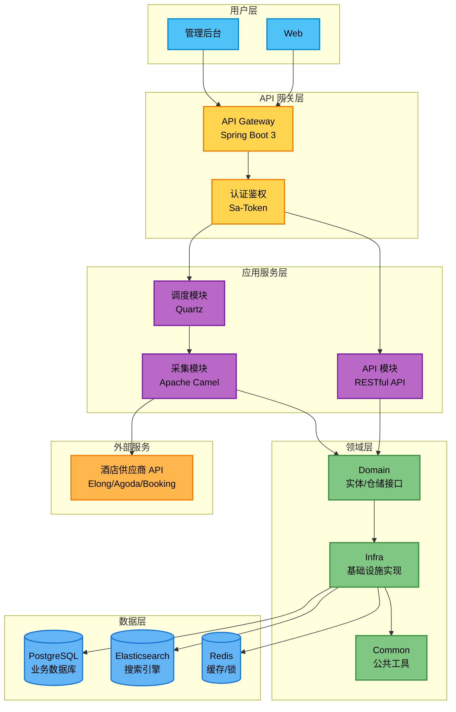
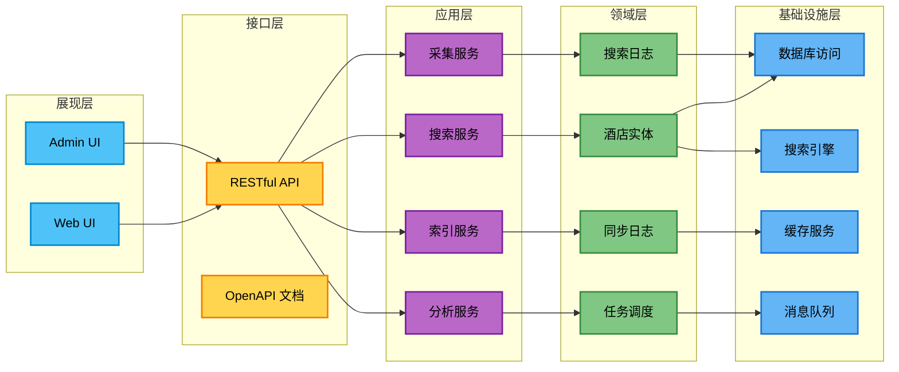
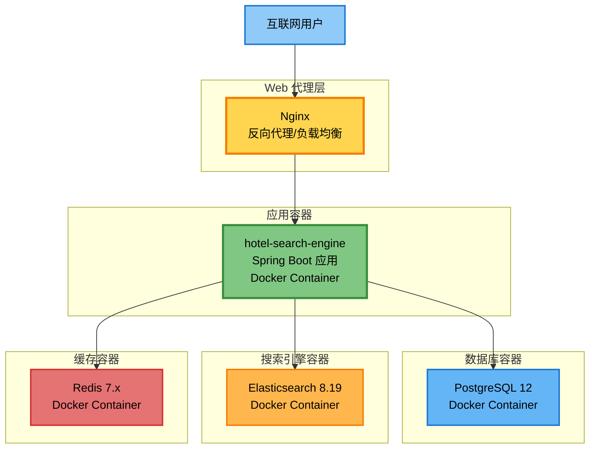
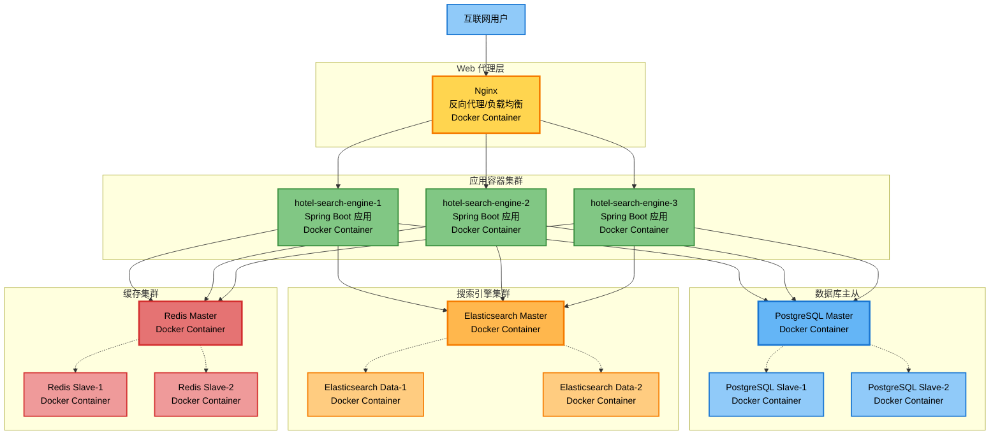
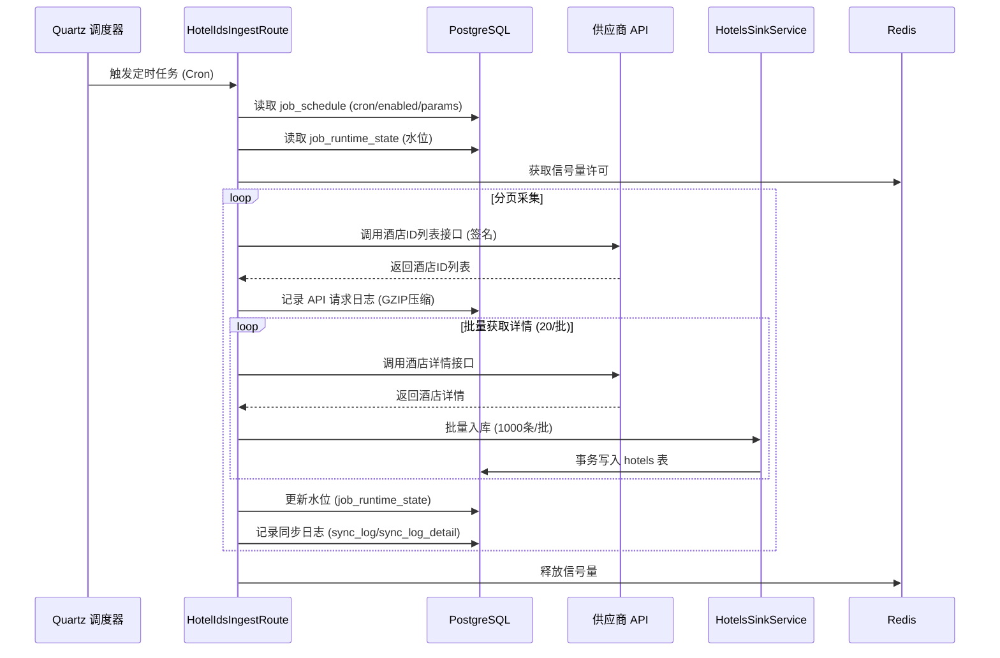
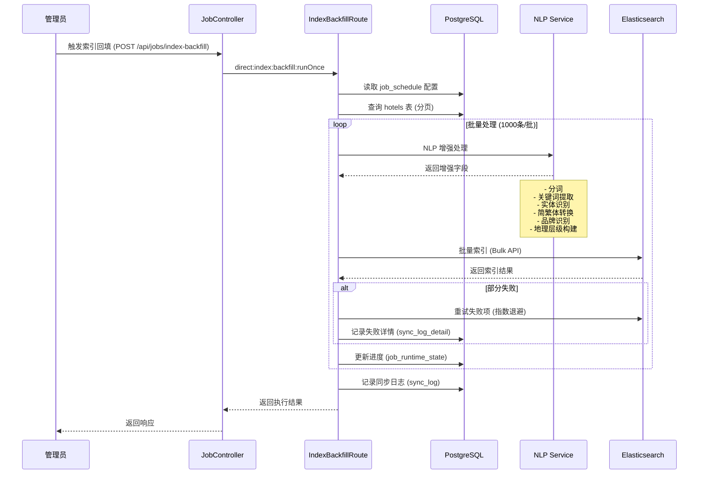
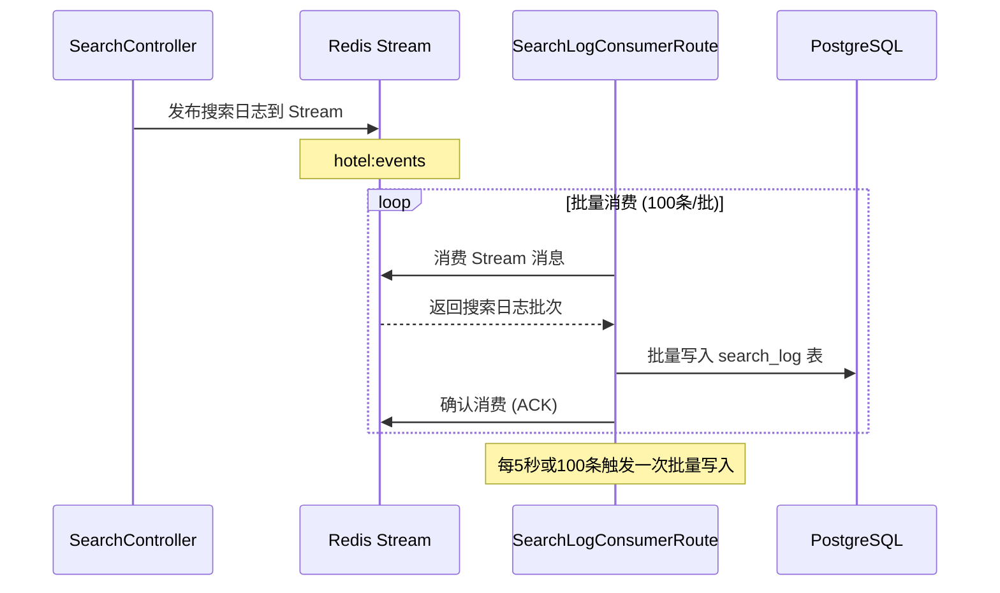
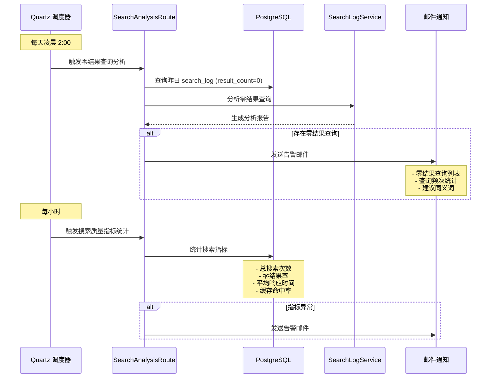

# 🏨 酒店搜索引擎 (HeyTrip & Hotel Search Engine)

[](https://www.oracle.com/java/)
[](https://spring.io/projects/spring-boot)
[](https://www.elastic.co/)
[](https://camel.apache.org/)
[](https://hanlp.hankcs.com/)
[](https://redis.io/)
[](https://www.postgresql.org/)


> 一个基于 Elasticsearch 和 NLP 技术的智能酒店搜索引擎，支持多维度搜索、中文分词、拼音搜索、同义词扩展等功能。

---

## 📋 目录

- [项目简介](#-项目简介)
- [核心特性](#-核心特性)
- [技术架构](#️-技术架构)
- [技术栈](#️-技术栈)
- [项目结构](#-项目结构)
- [核心功能流程](#-核心功能流程)
- [快速开始](#-快速开始)
- [相关文档](#-相关文档)

---

## 📖 项目简介

**酒店搜索引擎**是一个面向酒店预订平台的企业级搜索解决方案，旨在为用户提供快速、精准、智能的酒店搜索体验。

### 业务场景

- **多源数据整合**：支持国内（CN）、国际（INTL）、港澳台（HMT）三大业务域的酒店数据
- **多供应商接入**：整合 Elong、Agoda、Booking 等多家酒店供应商数据
- **智能搜索**：基于 Elasticsearch 的全文检索，支持中文分词、拼音搜索、同义词扩展
- **地理位置搜索**：支持基于经纬度的地理位置搜索和距离排序
- **实时数据同步**：通过 Apache Camel 路由实现酒店数据的实时采集和索引更新

### 数据规模

- **酒店总量**：360万+ 酒店（国内 210万 + 国际 150万）
- **索引字段**：30+ 个搜索字段，包括酒店名称、地址、品牌、设施等
- **NLP 增强**：支持简繁体转换、关键词提取、命名实体识别、品牌识别等
- **搜索性能**：平均响应时间 <500ms，P95 <1s，峰值 QPS 500+

### 核心能力

1. **多语言支持**：中文（简繁体）、英文、拼音搜索
2. **智能分词**：基于 IK 分词器和 HanLP 的中文分词
3. **同义词扩展**：800+ 条同义词规则，覆盖城市、地标、交通、设施、品牌等
4. **地理层级**：洲 → 国家 → 省/州 → 市 → 区的完整地理层级路径
5. **搜索质量分析**：零结果查询分析、搜索日志分析、质量指标监控

---

## ✨ 核心特性

### 🔍 搜索功能

- ✅ **全文搜索**：支持酒店名称、地址、品牌、描述等多字段搜索
- ✅ **拼音搜索**：支持拼音首字母和全拼搜索（如 "BJ" → "北京"）
- ✅ **同义词搜索**：自动扩展同义词（如 "首都机场" → "北京首都国际机场"）
- ✅ **地理位置搜索**：基于经纬度的附近酒店搜索
- ✅ **多条件过滤**：按城市、区域、品牌、价格等多维度过滤
- ✅ **智能排序**：综合相关性、距离、评分等多因素排序

### 📊 数据处理

- ✅ **实时数据采集**：基于 Apache Camel 的数据采集路由
- ✅ **增量同步**：支持全量和增量数据同步
- ✅ **数据清洗**：自动去重、格式化、验证
- ✅ **NLP 增强**：分词、关键词提取、实体识别、简繁体转换
- ✅ **索引优化**：自动生成搜索优化字段

### 🔧 运维管理

- ✅ **索引管理**：一键重建索引、别名切换、零停机更新
- ✅ **同义词管理**：分类管理、热更新、版本控制
- ✅ **任务调度**：基于 Quartz 的定时任务调度
- ✅ **监控告警**：搜索质量监控、零结果查询告警
- ✅ **API 日志**：完整的 API 请求日志和审计

---

## 🏗️ 技术架构

### 整体架构图



### 系统分层架构



### 部署架构（Docker 单实例）



### 部署架构（Docker 多实例）



---

## 🛠️ 技术栈

### 后端技术栈

#### 核心框架
- **Java 17** - 编程语言
- **Spring Boot 3.5.7** - 应用框架
- **Spring Data JPA** - ORM 框架
- **Apache Camel 4.14.0** - 集成框架/路由引擎

#### 数据存储
- **PostgreSQL 12** - 关系型数据库
- **Elasticsearch 8.19.6** - 搜索引擎
- **Redis 7.x** - 缓存和分布式锁
- **HikariCP** - 数据库连接池

#### 搜索增强
- **IK Analyzer 8.19.6** - 中文分词
- **Pinyin Analyzer 8.19.6** - 拼音分词
- **HanLP 1.8.6** - NLP 工具包
  - 简繁体转换
  - 关键词提取
  - 命名实体识别
  - 品牌识别

#### 中间件
- **Redisson 3.46.0** - Redis 客户端（分布式锁/信号量）
- **Quartz** - 任务调度

#### 安全认证
- **Sa-Token** - 认证授权框架

#### 工具库
- **Lombok 1.18.42** - 简化 Java 代码
- **Hutool 5.8.41** - Java 工具类库
- **Jackson** - JSON 序列化
- **SpringDoc 2.8.13** - OpenAPI 文档生成
- **Therapi JavaDoc 0.15.0** - JavaDoc 增强

#### 测试框架
- **JUnit 5** - 单元测试
- **TestContainers** - 集成测试
- **Mockito** - Mock 框架

### 前端技术栈
- **Next.js 14+** - React 全栈框架
- **TypeScript** - 类型安全
- **Shadcn/ui** - UI 组件库
- **Tailwind CSS** - 样式框架
- **React Query** - 数据获取和缓存
- **Zustand** - 状态管理

### 开发工具链
- **Maven 3.9+** - 构建工具
- **Docker & Docker Compose** - 容器化
- **Git & Gitea** - 版本控制
- **Gitea CI** - 持续集成
- **IntelliJ IDEA** - IDE

---

## 📁 项目结构

```
hotel-search-engine/
├── backend/                          # 后端代码
│   ├── api/                          # API 接口层
│   │   └── src/main/java/.../api/
│   │       ├── controller/           # REST 控制器
│   │       ├── dto/                  # 数据传输对象
│   │       └── config/               # API 配置
│   │
│   ├── app/                          # 应用启动模块
│   │   └── src/main/
│   │       ├── java/.../app/         # 启动类
│   │       └── resources/            # 配置文件
│   │           ├── application.yml
│   │           ├── application-dev.yml
│   │           └── application-prod.yml
│   │
│   ├── common/                       # 公共模块
│   │   ├── data/                     # HanLP 数据文件
│   │   │   ├── dictionary/           # 词典文件
│   │   │   │   ├── custom/           # 自定义词典
│   │   │   │   ├── synonym/          # 同义词词典
│   │   │   │   └── tc/               # 简繁体转换
│   │   │   └── model/                # NLP 模型
│   │   └── src/main/java/.../common/
│   │       ├── config/               # 公共配置
│   │       ├── util/                 # 工具类
│   │       ├── exception/            # 异常定义
│   │       └── constant/             # 常量定义
│   │
│   ├── domain/                       # 领域模型层
│   │   └── src/main/java/.../domain/
│   │       ├── entity/               # 实体类
│   │       │   ├── Hotels.java
│   │       │   ├── SearchLog.java
│   │       │   ├── SyncLog.java
│   │       │   └── JobSchedule.java
│   │       ├── repository/           # 仓储接口
│   │       └── valueobject/          # 值对象
│   │
│   ├── infra/                        # 基础设施层
│   │   ├── scripts/                  # 脚本文件
│   │   │   └── rebuild_hotels_index.json
│   │   └── src/main/java/.../infra/
│   │       ├── config/               # 基础设施配置
│   │       ├── repository/           # 仓储实现
│   │       ├── search/               # Elasticsearch
│   │       │   ├── doc/              # ES 文档实体
│   │       │   └── EsHotelIndexService.java
│   │       ├── redis/                # Redis 实现
│   │       ├── nlp/                  # NLP 服务
│   │       └── notify/               # 通知服务
│   │
│   ├── ingest/                       # 数据采集模块
│   │   └── route-camel/
│   │       └── src/main/java/.../ingest/
│   │           ├── route/            # Camel 路由
│   │           │   ├── HotelIdsIngestRoute.java
│   │           │   ├── IndexBackfillRoute.java
│   │           │   ├── SearchLogConsumerRoute.java
│   │           │   └── SearchAnalysisRoute.java
│   │           ├── service/          # 采集服务
│   │           ├── dto/              # 数据传输对象
│   │           └── model/            # 上下文模型
│   │
│   ├── scheduler-cron/               # 定时任务模块
│   │   └── src/main/java/.../scheduler/
│   │       └── config/               # Quartz 配置
│   │
│   └── pom.xml                       # Maven 父 POM
│
├── deploy/                           # 部署配置
│   ├── docker/                       # Docker 配置
│   │   └── docker-compose.yml
│   └── elasticsearch/                # ES 配置
│       └── analysis/                 # 分词器配置
│           ├── hotel_synonyms.txt    # 主同义词文件
│           ├── synonyms/             # 分类同义词
│           │   ├── city_synonyms.txt
│           │   ├── landmark_synonyms.txt
│           │   ├── transport_synonyms.txt
│           │   ├── facility_synonyms.txt
│           │   └── brand_synonyms.txt
│           └── README.md
│
├── scripts/                          # 脚本工具
│   ├── rebuild_hotels_index.sh       # 索引重建脚本
│   ├── rebuild_hotels_index.json     # 索引映射配置
│   ├── merge_synonym_files.sh        # 同义词合并脚本
│   ├── generate_hanlp_cache.sh       # HanLP 缓存生成
│   └── HanLPCacheGenerator.java      # 缓存生成器
│
├── docs/                             # 文档
│   ├── 轻量级架构方案.md
│   ├── 同义词管理与维护方案.md
│   ├── ES索引配置与实体类对比检查.md
│   ├── HanLP缓存预生成指南.md
│   └── 第二周增强功能实施记录.md
│
└── README.md                         # 项目说明文档
```

### 模块说明

| 模块 | 职责 | 依赖 |
|------|------|------|
| **api** | REST API 接口、控制器、DTO | domain, infra |
| **app** | 应用启动、配置管理 | api, ingest, scheduler |
| **common** | 公共工具、常量、异常 | 无 |
| **domain** | 领域实体、仓储接口 | common |
| **infra** | 基础设施实现（DB、ES、Redis） | domain, common |
| **ingest** | 数据采集路由、同步服务 | domain, infra |
| **scheduler** | 定时任务调度 | ingest |

---

## 🔄 核心功能流程

### 1. 酒店数据采集流程

**流程说明**：通过 Apache Camel 路由从供应商 API 采集酒店数据，支持分页、断点续传、并发控制。



**关键步骤**：

1. **任务调度**：Quartz 根据 `job_schedule.cron_expr` 触发任务
2. **并发控制**：Redisson 信号量限制并发数（≤10）
3. **分页采集**：按页获取酒店ID列表，支持断点续传
4. **批量详情**：20个ID/批调用详情接口
5. **批量入库**：1000条/批事务写入数据库
6. **水位更新**：记录当前采集进度，支持增量同步
7. **日志记录**：完整的 API 请求/响应日志（GZIP压缩）

### 2. 索引回填流程

**流程说明**：将数据库中的酒店数据批量索引到 Elasticsearch，包含 NLP 增强处理。



**NLP 增强字段**：

- `nameTokens`: 酒店名称分词结果
- `addressTokens`: 地址分词结果
- `nameKeywords`: 酒店名称关键词
- `nerPlaces`: 地址中的地名实体
- `nerBrands`: 品牌实体识别
- `nameTraditional`: 繁体酒店名称
- `addressTraditional`: 繁体地址
- `brandNames`: 品牌名称列表
- `geoHierarchy`: 地理层级路径（洲→国家→省→市→区）

### 3. 搜索日志消费流程

**流程说明**：异步消费搜索日志，批量写入数据库，用于搜索质量分析。



### 4. 搜索质量分析流程

**流程说明**：定时分析搜索日志，生成质量报告和告警。



**分析指标**：

- **零结果率**：零结果查询数 / 总查询数
- **平均响应时间**：搜索请求的平均耗时
- **缓存命中率**：缓存命中次数 / 总查询数
- **热门查询**：查询频次 TOP 100
- **零结果查询**：无结果的查询关键词列表

### 5. 索引重建流程

**流程说明**：零停机重建 Elasticsearch 索引，通过别名切换实现平滑升级。

```mermaid
graph LR
    Start([开始]) --> CheckConflict[检查别名冲突]
    CheckConflict --> CreateIndex[创建新索引<br/>hotels_YYYYMMDD_HHMMSS]
    CreateIndex --> Reindex{源索引<br/>是否存在?}
    
    Reindex -->|是| CopyData[Reindex 数据<br/>从旧索引到新索引]
    Reindex -->|否| SwitchAlias[原子性切换别名]
    CopyData --> SwitchAlias
    
    SwitchAlias --> UpdateReadAlias[更新读别名<br/>hotels_read]
    UpdateReadAlias --> UpdateWriteAlias[更新写别名<br/>hotels_write]
    UpdateWriteAlias --> DeleteOld{是否删除<br/>旧索引?}
    
    DeleteOld -->|是| RemoveOld[删除旧索引<br/>保留新索引]
    DeleteOld -->|否| Verify[验证索引状态]
    RemoveOld --> Verify
    
    Verify --> End([完成])
    
    style Start fill:#4FC3F7,stroke:#0288D1,stroke-width:3px,color:#000
    style CheckConflict fill:#FFD54F,stroke:#F57C00,stroke-width:2px,color:#000
    style CreateIndex fill:#81C784,stroke:#388E3C,stroke-width:2px,color:#000
    style Reindex fill:#BA68C8,stroke:#7B1FA2,stroke-width:2px,color:#000
    style CopyData fill:#FFB74D,stroke:#F57C00,stroke-width:2px,color:#000
    style SwitchAlias fill:#64B5F6,stroke:#1976D2,stroke-width:3px,color:#000
    style UpdateReadAlias fill:#81C784,stroke:#388E3C,stroke-width:2px,color:#000
    style UpdateWriteAlias fill:#81C784,stroke:#388E3C,stroke-width:2px,color:#000
    style DeleteOld fill:#BA68C8,stroke:#7B1FA2,stroke-width:2px,color:#000
    style RemoveOld fill:#E57373,stroke:#D32F2F,stroke-width:2px,color:#000
    style Verify fill:#FFD54F,stroke:#F57C00,stroke-width:2px,color:#000
    style End fill:#4FC3F7,stroke:#0288D1,stroke-width:3px,color:#000
```



**重建步骤**：

```bash
# 1. 运行索引重建脚本
./scripts/rebuild_hotels_index.sh

# 2. 脚本自动执行：
#    - 创建新索引（带时间戳）
#    - 从旧索引 Reindex 数据
#    - 原子性切换读写别名
#    - 删除旧索引（可选）

# 3. 验证
curl -u elastic:password http://localhost:9200/_cat/aliases/hotels_*?v
```

---

## 🚀 快速开始

### 环境要求

- **JDK 17+**
- **Maven 3.9+**
- **Docker & Docker Compose**
- **PostgreSQL 12+**
- **Elasticsearch 8.19.6**
- **Redis 7.x**

### 本地开发环境搭建

#### 1. 启动基础设施

```bash
# 启动 PostgreSQL、Elasticsearch、Redis
cd deploy/docker
docker-compose up -d

# 验证服务状态
docker-compose ps
```

#### 2. 初始化数据库

```bash
# 执行数据库迁移脚本
psql -h localhost -U postgres -d hotel_search < scripts/init_db.sql
```

#### 3. 配置 Elasticsearch

```bash
# 创建索引
./scripts/rebuild_hotels_index.sh

# 验证索引
curl http://localhost:9200/_cat/indices/hotels_*?v
```

#### 4. 生成 HanLP 缓存

```bash
# 预生成 HanLP 缓存文件
./scripts/generate_hanlp_cache.sh
```

#### 5. 编译和运行

```bash
# 编译项目
cd backend
mvn clean install -DskipTests

# 运行应用
cd app
mvn spring-boot:run

# 或者运行打包后的 JAR
java -jar target/hotel-search-engine-app-1.0.0.jar
```

#### 6. 访问应用

- **API 文档**: http://localhost:8080/swagger-ui.html
- **健康检查**: http://localhost:8080/actuator/health
- **Elasticsearch**: http://localhost:9200
- **Redis**: localhost:6379

### Docker 部署

```bash
# 构建镜像
docker build -t hotel-search-engine:latest .

# 运行容器
docker run -d \
  --name hotel-search-engine \
  -p 8080:8080 \
  -e SPRING_PROFILES_ACTIVE=prod \
  -e DB_HOST=postgres \
  -e ES_HOST=elasticsearch \
  -e REDIS_HOST=redis \
  hotel-search-engine:latest
```

---

## 📚 相关文档

### 架构设计

- [轻量级架构方案](docs/轻量级架构方案.md) - 整体架构设计和技术选型
- [ES索引配置与实体类对比检查](docs/ES索引配置与实体类对比检查.md) - Elasticsearch 配置说明

### 功能实现

- [同义词管理与维护方案](docs/同义词管理与维护方案.md) - 同义词管理完整方案
- [同义词实现方案](docs/同义词实现方案.md) - Elasticsearch Synonym Filter 实现
- [地理层级使用指南](docs/地理层级使用指南.md) - 地理层级字段使用说明

### 运维指南

- [HanLP缓存预生成指南](docs/HanLP缓存预生成指南.md) - HanLP 缓存生成和配置
- [同义词扩展总结](docs/同义词扩展总结.md) - 同义词扩展统计和说明

### 脚本工具

- `scripts/rebuild_hotels_index.sh` - 索引重建脚本
- `scripts/merge_synonym_files.sh` - 同义词文件合并脚本
- `scripts/generate_hanlp_cache.sh` - HanLP 缓存生成脚本
- `scripts/analyze_search_logs_for_synonyms.sh` - 搜索日志分析脚本

---


### 开发规范

- 遵循 [阿里巴巴 Java 开发手册](https://github.com/alibaba/p3c)
- 使用 Lombok 简化代码
- 编写单元测试和集成测试
- 提交前运行 `mvn clean verify`

### 提交规范

```bash
# 功能开发
git commit -m "feat: 添加酒店搜索功能"

# Bug 修复
git commit -m "fix: 修复分页查询问题"

# 文档更新
git commit -m "docs: 更新 README 文档"

# 代码重构
git commit -m "refactor: 重构索引服务"
```

---

